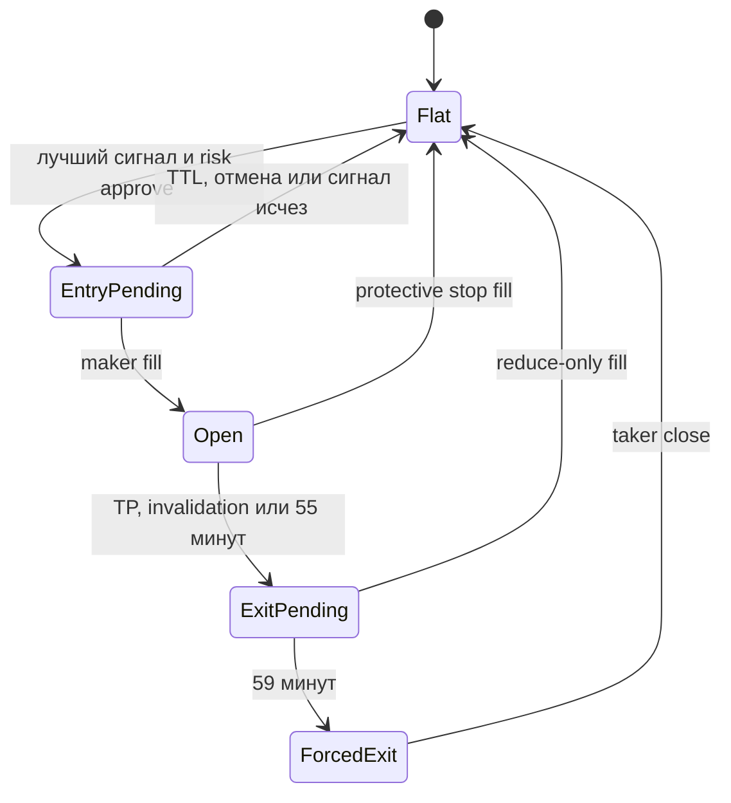

# MVP specification

Версия: `0.3`
Статус: collector, канонический dataset и causal features/labels, без торговых полномочий

## 1. Цель

Создать локальную, воспроизводимую систему для краткосрочной торговли USDT perpetual
фьючерсами Bybit. Горизонт одной позиции — не более часа. Модель должна оценивать
ожидаемый результат **после** комиссий и реалистичного исполнения, а отдельный risk
engine — независимо разрешать или запрещать сделку.

До доказательства преимущества в walk-forward backtest и paper/testnet торговле система
остаётся read-only.

## 2. Universe и данные

Universe фиксирован на первом этапе:

`BTCUSDT`, `ETHUSDT`, `SOLUSDT`, `XRPUSDT`, `BNBUSDT`, `LINKUSDT`.

Собираются:

1. order book depth 50; входящие delta применяются в памяти, полное состояние хранится 1 раз/с;
2. публичные сделки без искусственного downsampling;
3. ticker 1 раз/с, включая доступные поля mark/index price, funding и open interest;
4. только подтверждённые (закрытые) свечи 1/5/15 минут;
5. exchange timestamp и локальное время получения для измерения задержки.

Каждая нормализованная запись имеет `schema_version`, `source` и `session_id`. Поле
`exchange_ts_ms` означает время формирования сообщения биржей, а `received_at_ns` — момент,
когда сообщение стало доступно нашему процессу. Все признаки и исторические решения строятся
строго по условию `received_at_ns <= decision_at_ns`; event timestamps внутри payload
(`T` сделки, `start/end` свечи и `matching_engine_ts_ms` стакана) не дают права использовать
запись раньше её фактического получения.

Для обучения нельзя смешивать train/test во времени. Все агрегации должны использовать
только сведения, реально доступные на момент решения.

## 3. Почему новости исключены из MVP

Для горизонта до 60 минут микроструктура, order flow, волатильность и ликвидность обычно
дают более прямой и более своевременный сигнал, чем полный текстовый news-анализ. Новости
остаются важным источником хвостового риска, но LLM-обработка добавляет задержку,
нестабильность и сложность честного исторического воспроизведения.

В MVP неожиданные события обрабатываются реактивно:

- запрет нового входа при аномальном spread/volatility;
- ограничение по stale data и задержке потока;
- обязательный биржевой stop-loss;
- daily loss circuit breaker.

После базовой модели можно отдельно A/B-тестировать простой event blackout и новостной
признак. Он добавляется только если улучшает out-of-sample результат после всех затрат.

## 4. Сигнальная модель

Первая кандидатная модель — локальный LightGBM/градиентный бустинг, а не ChatGPT в
контуре каждой сделки. Причины: детерминированная задержка, нулевая стоимость токенов,
воспроизводимость backtest и естественная работа с числовыми табличными признаками.

Кандидатные признаки:

- returns, realised volatility и range на нескольких окнах;
- spread, mid-price, microprice, глубина и дисбаланс стакана;
- signed trade flow, trade intensity, крупные принты;
- краткосрочный momentum/mean reversion;
- mark-index basis, funding, open interest;
- время суток, день недели и близость funding timestamp;
- режим рынка BTC и относительное движение альткоина.

Начальная схема — одна общая модель с идентификатором пары и отдельной калибровкой по
символам. Её обязательно сравниваем с простыми baseline и отдельными моделями для пар.
Сложная модель принимается только при устойчивом улучшении на нескольких временных
fold и рыночных режимах.

Рыночные метки строятся для горизонтов 5/15/30/60 минут с triple-barrier или net-return
подходом: `TP_FIRST`, `SL_FIRST`, `TIMEOUT`, а неоднозначный порядок внутри недоступного
разрешения помечается отдельно. Комиссии, adverse selection, stop slippage и funding
учитываются до присвоения классу «торговать».

`NO_FILL`, partial fill и вероятность maker fill являются отдельными execution labels.
Их нельзя достоверно выводить из секундных L50 snapshots: для этого нужны более детальные
изменения стакана и последующая калибровка по demo fills. До simulator stage модель не должна
выдавать приблизительную оценку исполнения за наблюдённый факт.

## 5. Выбор одной сделки

Каждый цикл все шесть пар получают сравнимый score. Если нет уже открытой позиции или
активного entry-order, выбирается только лучший кандидат, прошедший:

1. минимальный порог ожидаемой net edge;
2. liquidity/spread/slippage gate;
3. volatility и stale-data gate;
4. risk limits;
5. cooldown и rolling-loss circuit breaker.

Отсутствие сделки — нормальный и предпочтительный результат, если преимущество не
доказано.

## 6. Размер позиции и риск

Обозначения:

- `E` — текущая equity;
- `d = |entry - stop| / entry` — техническая дистанция stop-loss;
- `c` — консервативный буфер комиссий, проскальзывания и funding;
- `N` — номинал позиции.

Безопасное ограничение размера:

\[
N \le \min\left(0.05E,\;\frac{0.005E}{d+c}\right)
\]

и обязательная проверка:

\[
N(d+c) \le 0.007E.
\]

`0.5%` — бюджет, а не квота: позиция не увеличивается и stop не отодвигается только
ради полного расходования риска. При текущем консервативном лимите номинала 5% equity
фактический риск нормальной часовой сделки почти всегда будет существенно меньше 0,5%.

Значение «5% депозита» перед реализацией live execution нужно подтвердить. Если оно
означает маржу с плечом, требуется отдельный лимит номинала, ликвидационного расстояния
и максимально разрешённого плеча. До такого решения используется трактовка 5% nominal.

Торговля блокируется минимум до ручной проверки, когда rolling 24h realised loss плюс
консервативная оценка открытого риска достигает 1% equity.

## 7. Исполнение

Планируемая машина состояний:

Правила:

- entry — `PostOnly`; пересёкший spread ордер биржа должна отклонить/отменить, а не
  превратить в taker;
- entry TTL по умолчанию 45 секунд; после отмены сигнал оценивается заново;
- частичное исполнение считается позицией и блокирует остальные пары;
- TP — maker, когда остаётся достаточно времени и ликвидности;
- stop-loss размещается на бирже сразу после fill и имеет приоритет над экономией комиссии;
- любой exit — `reduce-only`; на 59-й минуте разрешён taker close;
- состояние после reconnect сверяется с биржей, локальный кэш не считается источником истины.

## 8. Метрики принятия модели

Accuracy не является основной метрикой. Нужны как минимум:

- net PnL после всех затрат;
- maximum drawdown;
- Sharpe/Sortino с осторожной интерпретацией;
- profit factor и expectancy на сделку;
- turnover и доля maker fills;
- результаты по каждой паре, часу суток и режиму волатильности;
- worst fold и чувствительность к удвоенным комиссиям/проскальзыванию;
- число сигналов и доверительный интервал результата.

Переход к следующей стадии разрешён только если результат устойчив в walk-forward тестах,
не зависит от одной пары/недели и переживает stress-сценарии затрат.

## 9. Этапы

| Этап | Результат | Торговые полномочия |
|---|---|---|
| 1. Collector | качественные публичные данные и health monitoring — готов | нет |
| 2a. Canonical dataset | audited JSONL → typed versioned Parquet — реализовано | нет |
| 2b. Features и labels | causal features, decision grid, market labels — реализовано | нет |
| 3. Research | baseline, LightGBM, walk-forward backtest | нет |
| 4. Simulator | maker queue/partial fills/slippage/funding | нет |
| 5. Testnet/paper | state machine, reconciliation, alerts, kill switch | testnet |
| 6. Tiny live | минимальный номинал и ручное наблюдение | ограниченные |
| 7. Scale review | увеличение только по накопленной статистике | по решению владельца |

## 10. Обязательные защиты перед private API

- отдельный Bybit subaccount;
- API key без права вывода средств и с IP allowlist;
- секреты только в secret manager/environment, никогда в Git;
- testnet по умолчанию и отдельное явное включение live;
- max order size, max notional, max leverage и symbol allowlist в коде;
- idempotent client order IDs и журнал всех решений/ордеров/fills;
- reconciliation после запуска и reconnect;
- heartbeat watchdog, stale-data gate и аварийный kill switch;
- оповещение при каждом открытии/закрытии, ошибке и срабатывании circuit breaker.

## 11. Критерий готовности текущего этапа

Collector считается готовым к длительному запуску, когда:

- конфигурация и unit-тесты проходят локально;
- подтверждена реальная подписка на 36 public topics;
- данные каждой пары появляются во всех включённых потоках;
- sequence/snapshot обработка стакана проверена на reconnect;
- health-файл показывает актуальные сообщения и очередь не растёт;
- 24-часовой soak test не выявляет утечек, повреждённых JSONL или нехватки диска.

Потоковый `audit-data` является обязательным gate между Collector и Dataset stage. Он должен
проверить схему, coverage, causal timestamps, пропуски, повторные доставки, kline-ревизии,
стакан, задержку, остаточные `.partial`-файлы и зафиксировать fingerprint входных сегментов.
Raw-события не переписываются: при нескольких версиях закрытой свечи канонический Dataset stage
обязан выбрать причинно последнюю запись по `received_at_ns` и отклонить разные payload с
одинаковым временем получения. Операционная процедура описана в
[`SOAK_TEST.md`](SOAK_TEST.md), а контракт Parquet-слоя — в
[`DATASET.md`](DATASET.md). Контракт следующего read-only слоя описан в
[`FEATURES_AND_LABELS.md`](FEATURES_AND_LABELS.md).
